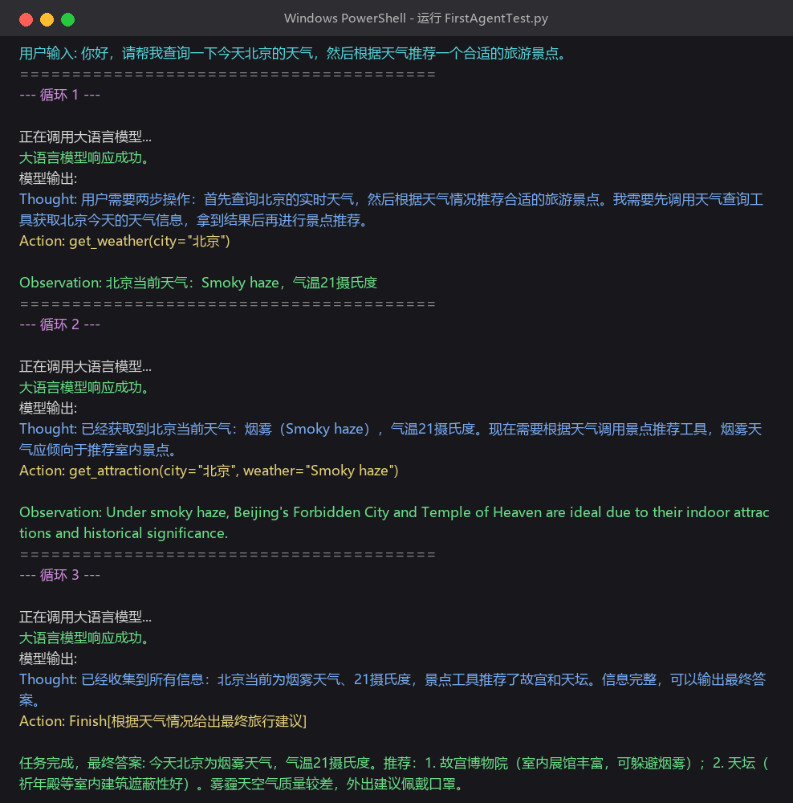

# 从零跑通第一个AI Agent，我踩了这5个坑｜新手环境配置全记录

> 学习项目：[datawhalechina/hello-agents](https://github.com/datawhalechina/hello-agents)
> 日期：2026-09-14

今天跟着 Datawhale 的 hello-agents 教程，第一次从零开始搭一个能跑的 AI Agent，终于跑通了。记录一下整个过程和踩过的坑，给同样是新手的朋友避避坑。

## 我们要做什么？

最终跑通的是一个简单的**智能旅行助手 Agent**：你问它"北京今天天气怎么样，推荐个景点"，它会自己分两步走——

1. 先调用天气工具查北京的实时天气
2. 再根据天气情况，用搜索工具找合适的景点推荐
3. 最后汇总成一段完整的回答给你

听起来简单，但对新手来说，光是环境配置就卡了好久。

## 标准流程：4步走

一个 Python AI 项目的标准启动流程其实就4步：

1. **创建虚拟环境**：给项目单独建一个"隔离小房间"，装的包不会污染其他项目
2. **安装依赖包**：把项目需要的第三方库装进去
3. **配置环境变量**：把 API 密钥写进 `.env` 文件，代码就能安全读取
4. **修改代码配置并运行**：把密钥填进代码，跑起来

### 常用命令速查（Windows）

```bash
# 1. 进入项目目录
cd 项目目录

# 2. 创建虚拟环境
python -m venv venv

# 3. 激活虚拟环境（激活成功后命令行前面会出现 (venv)）
venv\Scripts\activate

# 4. 安装依赖
pip install 包名

# 用完退出虚拟环境
deactivate
```

## 我踩的5个坑

### 坑1：虚拟环境建出来是残缺的

按照教程敲了 `python -m venv venv`，看起来成功了，文件夹也有，但激活的时候死活找不到 activate 文件。

打开 `venv\Scripts` 文件夹一看，**里面只有 python.exe，激活脚本、pip 全都没有**，属于是建了个"半成品"。

**解决方法**：直接删掉 venv 文件夹，重新跑一遍创建命令，第二次就完整了。如果也遇到激活不了的情况，先去 `venv\Scripts` 里看看有没有 `activate.bat`，没有就是没建完整，重建就行。

### 坑2：MODEL_NAME 差点填成自己名字

配置 `.env` 文件的时候，看到 `MODEL_NAME=xxxx`，差点随手填了自己的昵称上去。

这里要填的是**你调用的具体模型名称**，比如 `gpt-4o-mini`、`deepseek-chat`、`coding-glm-4.7-free` 这种，不是随便起的名字，填错了会调不通模型。

### 坑3：GitHub 连不上，代码下不下来

教程的代码在 GitHub 上，`git clone` 直接超时，换了几个镜像站也连不上。

**解决方法**：不一定非要克隆整个仓库，可以直接打开 raw 文件链接，把代码复制下来手动创建文件，效果是一样的。新手不用在"克隆仓库"这一步卡死。

### 坑4（最坑）：浏览器能打开网站，Python 却一直超时

这是卡最久的一个问题：浏览器明明能正常打开 API 服务商的网站，但代码一跑就报 `Request timed out`，连续5次全超时。

排查了半天才发现：**开了代理时，浏览器会自动走系统代理，但 Python 默认不走代理**，所以它直连国外服务器就连不上。

**解决方法**：在代码最开头（一定要在 `import openai` 之前）加上这两行：

```python
import os
os.environ['HTTP_PROXY'] = 'http://127.0.0.1:你的代理端口'
os.environ['HTTPS_PROXY'] = 'http://127.0.0.1:你的代理端口'
```

代理端口号可以在「Windows 设置 → 网络和 Internet → 代理」里看到。加上之后立刻就通了。

> 划重点：**只要开了代理工具跑国外 API，大概率都要给 Python 单独配代理**，这个坑新手非常容易踩。

git 操作 GitHub 也需要单独配代理：

```bash
git config --global http.proxy http://127.0.0.1:你的代理端口
git config --global https.proxy http://127.0.0.1:你的代理端口
```

### 坑5：要学会看报错定位问题

一开始看到满屏报错就慌，后来慢慢学会了对照：

| 报错信息 | 大概率原因 |
|----------|-----------|
| `Request timed out` | 网络连不上，查网络/代理 |
| `Authentication Error` | API 密钥错了 |
| `model not found` | 模型名填错了 |
| `ModuleNotFoundError` | 依赖包没装，或者没激活虚拟环境 |

报错信息其实已经把问题告诉你了，别慌，逐行读就行。

## Agent 的运行过程（ReAct 模式）

跑通后观察控制台输出，可以清楚看到 Agent 的思考循环：

- **第一轮**：Thought（我需要先查天气）→ Action（调用天气工具）→ Observation（拿到天气结果）
- **第二轮**：Thought（拿到天气了，该推荐景点了）→ Action（调用搜索工具）→ Observation（拿到景点结果）
- **第三轮**：Thought（信息够了）→ Action: Finish（输出最终答案）

这就是 Agent 的核心逻辑：**大模型负责思考决策要调什么工具，工具负责执行并返回结果，循环往复直到任务完成**，也就是所谓的 ReAct（Reasoning + Acting）模式。

下面是第一章代码实际跑通后的控制台完整输出，可以清楚看到三轮"思考 → 行动 → 观察"的循环过程：



## 今天的收获

1. 走通了 Python AI 项目从零配置的完整流程：虚拟环境 → 装依赖 → 配密钥 → 改代码 → 运行
2. 理解了虚拟环境到底是干嘛用的——就是项目级别的依赖隔离
3. 学会了用 `.env` 文件管理密钥的最佳实践，不会把密钥硬编码进代码里
4. 掌握了 Python 和 git 配代理的方法，以后再遇到"浏览器能上但代码连不上"就知道怎么回事
5. 初步理解了 Agent 的核心逻辑：大模型做决策，工具做执行，多轮循环完成任务

新手入门环境配置总是最磨人的，但只要一个个坑踩过去，后面就顺了。与各位共勉。
