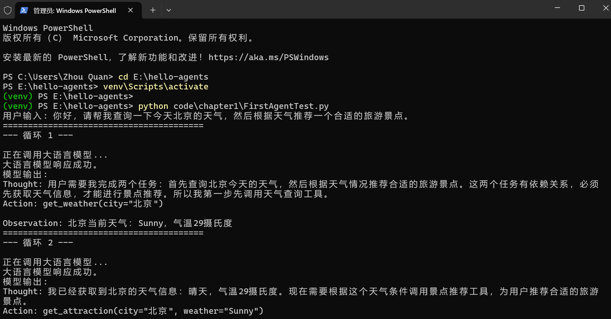
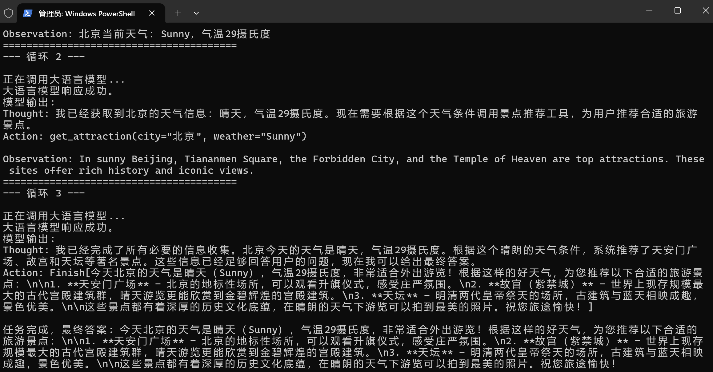

# Task01 第一章 初识智能体：概念与第一个 Agent

> 学习项目：[datawhalechina/hello-agents](https://github.com/datawhalechina/hello-agents)
> 日期：2026-09-15
> 任务：了解什么是智能体、核心组成；完成五分钟快速构建智能体实战

今天正式进入第一章。好消息是，"五分钟实战"的智能旅行助手，我已经能在自己的电脑上独立跑通了。这篇笔记把今天的概念和亲手运行的结果对应起来记录。

## 一、什么是智能体（Agent）

教程给出的定义：智能体是任何能够通过**传感器（Sensors）感知环境、自主地通过执行器（Actuators）采取行动、以达成特定目标**的实体。

四个基本要素，对应到我们的旅行助手：

| 要素 | 在本项目中是什么 |
|------|------------------|
| 环境（Environment） | 外部世界：天气服务、搜索引擎、用户 |
| 传感器（感知） | 用户输入、`wttr.in` 天气返回、Tavily 搜索结果 |
| 执行器（行动） | 调用 `get_weather`、`get_attraction` 两个工具函数 |
| 自主性（Autonomy） | 没有写死任何 if-else，由 LLM 自己决定先查天气还是先搜景点 |

最核心的一点：**它不是按预设流程跑，而是基于实时信息动态决策**。今天跑的时候天气是晴天 29°C，它推荐了天安门、故宫、天坛；如果换成雾霾天，它会自己推理出推荐室内景点。这种能力就是 Agent 和普通脚本的本质区别。

## 二、智能体的核心组成

一个 LLM 智能体由四块拼成：

1. **LLM（大脑）**：负责思考决策，对应代码里的 `OpenAICompatibleClient`。
2. **指令模板（system prompt）**：告诉 LLM 它是谁、有哪些工具、输出必须是 `Thought/Action` 格式——相当于智能体的"说明书"。
3. **工具（Tools）**：LLM 本身不能上网、不能查实时数据，必须靠工具与真实世界交互。本项目有 `get_weather` 和 `get_attraction`。
4. **主循环（Agent Loop）**：把上面三者串起来反复执行，直到任务完成。

## 三、运行机制：智能体循环（Agent Loop）

智能体不是一次性出答案，而是不断和环境交互的闭环：

```
感知 Observation ──► 思考 Thought（规划 + 选工具）──► 行动 Action（调工具）
     ▲                                                          │
     │                                                          ▼
     └────────────── 环境返回新的 Observation ◄──── 执行工具，环境状态变化
```

- **感知**：接收用户请求或上一轮工具的返回结果。
- **思考**：LLM 分析当前情况，决定下一步做什么、调哪个工具、传什么参数。
- **行动**：真正去调用工具，改变环境状态。
- **观察**：工具结果被整理成简洁文本，喂回下一轮。

## 四、Thought–Action–Observation 交互范式

这是本章最该记住的输出格式：

```
Thought: 用户想知道北京天气，我需要先调用天气工具。
Action: get_weather(city="北京")
Observation: 北京当前：Sunny，气温29摄氏度
```

- `Thought`：内部决策的"快照"，自然语言解释为什么这么做。
- `Action`：对外部世界的具体操作，以函数调用形式给出。
- `Observation`：环境返回的结果，整理成自然语言喂回下一轮。

## 五、今天的实战：自己独立跑通

这次是我自己在 PowerShell 里从激活虚拟环境开始一步步操作的，没有让别人代劳：

```powershell
cd E:\hello-agents
venv\Scripts\activate        # 成功后前面出现绿色 (venv)
python code\chapter1\FirstAgentTest.py
```

下面两张是今天真实运行的控制台截图：



第一轮里，它的 Thought 很关键——它**自己分析出了两个任务之间的依赖关系**："必须先获取天气信息，才能进行景点推荐，所以第一步先调用天气工具"。然后调用 `get_weather(city="北京")`，拿到 `Sunny，29°C`。



接着完整走了三轮：

| 轮次 | Thought（思考） | Action（行动） | Observation（观察） |
|------|----------------|----------------|---------------------|
| 循环 1 | 两任务有依赖，先查天气 | `get_weather("北京")` | 北京 Sunny，29°C |
| 循环 2 | 拿到天气，去搜景点 | `get_attraction("北京","Sunny")` | 天安门、故宫、天坛 |
| 循环 3 | 信息够了，给最终答案 | `Finish[...]` | 任务完成，输出完整建议 |

最后它给出的答案：今天北京晴天、29°C，适合外出，推荐天安门广场、故宫、天坛，并提醒这些景点历史底蕴深厚、晴天拍照好看。

## 六、一个关键认知：Workflow ≠ Agent

教程里特别强调了区别：

- **工作流（Workflow）**：流程是人提前写死的，"如果晴天就推颐和园"这种规则写在代码里。
- **智能体（Agent）**：LLM 是大脑，自主理解环境、推理、选工具、动态决策。今天天气是 29°C 晴天它推户外景点，换个天气它会自己换策略——**没有任何一行代码写死这个分支**。

这种"基于实时信息动态推理"的能力，才是 Agent 的核心价值。

## 七、今天的收获

1. 建立了智能体的基本定义：感知环境 → 自主决策 → 采取行动 → 达成目标。
2. 记住了 LLM 智能体的四大组成：**LLM 大脑 + 指令模板 + 工具 + 主循环**。
3. 理解了 Agent Loop 闭环和 `Thought-Action-Observation` 三段式交互。
4. 能独立完成从激活虚拟环境到运行脚本的全流程，不再怕命令行。
5. 直观感受到了"自主性"：Agent 自己分析任务依赖、自己决定调用顺序，而不是照着写死的剧本走。

明天进入第二章《智能体发展史》，看看这个概念是怎么一步步演进来的。
