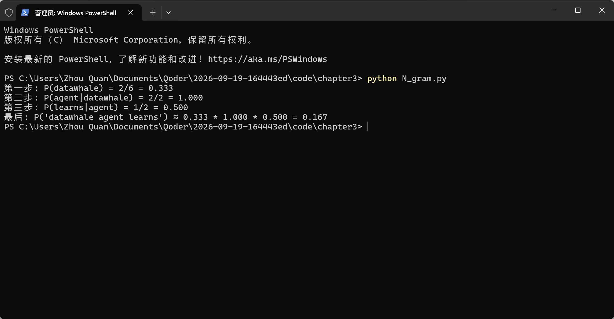
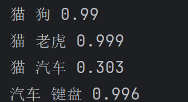
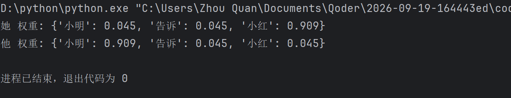
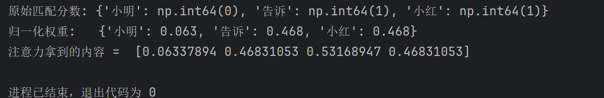
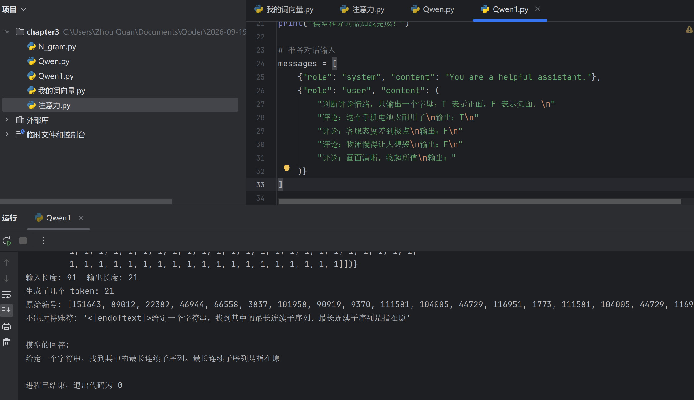
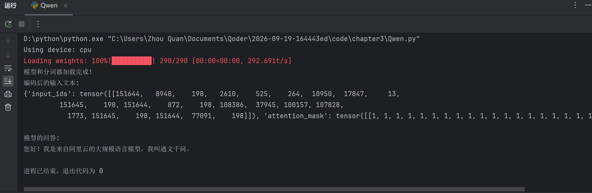
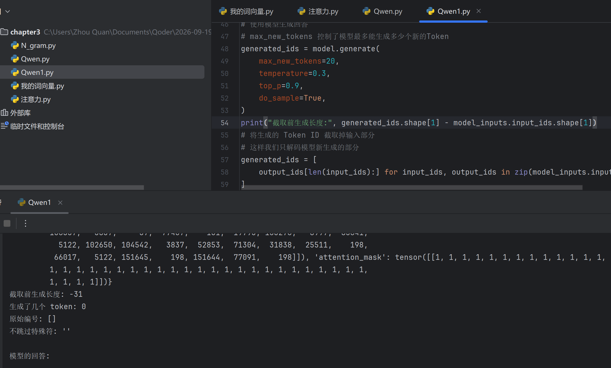
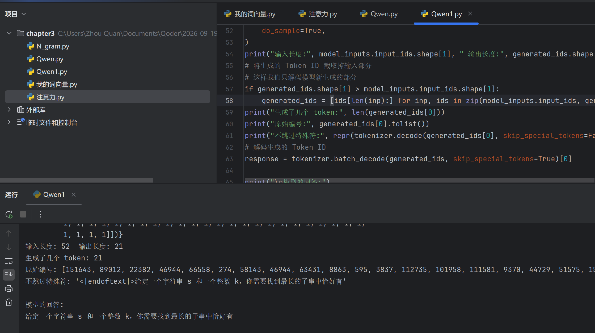

# Task03 第三章 大语言模型基础：拆开那个"大脑"看看

> 学习项目：[datawhalechina/hello-agents](https://github.com/datawhalechina/hello-agents)
> 日期：2026-09-17（2026-09-19 补：动手实验与踩坑）
> 任务：搞清 LLM 内部到底怎么运作——从 N-gram 一路推到 Decoder-Only，再学会怎么和它打交道

第二章的结论是「现代智能体 = 神经-符号结合，LLM 充当那个会推理的大脑」。但大脑内部我一直是个黑箱：它凭什么能预测下一个词？为什么 Transformer 能并行而 RNN 不能？`Temperature` 到底在调什么？今天这一章就是来拆这个箱子的。

读完最大的感受是，**这一章的主线和第二章一模一样，还是"痛点驱动"**，只不过尺度从七十年缩到了十几年，节奏快得多：

```
N-gram（数词对频率）
   ↓ 死结：没见过的组合概率就是 0，且不懂 agent 和 robot 是一类东西
神经语言模型（词嵌入 + 固定窗口）
   ↓ 死结：语义有了，但窗口固定，早期历史被直接丢弃
RNN / LSTM（隐藏状态当记忆）
   ↓ 死结：梯度消失 + 必须串行，长序列又慢又学不会
Transformer（注意力，全并行）
   ↓ 代价：注意力不认识"顺序"，得外挂位置编码
Decoder-Only（砍掉编码器，只做文字接龙）
   ↓ 意外收获：目标简单到极致 → 能吃无标注数据 → 规模一大就涌现
今天的大模型
```

注意最后一跳的性质变了：前面每次都是"补上一个缺陷"，而 Decoder-Only 是**主动做减法**，结果减出了涌现能力。这一点我觉得是全章最值得琢磨的地方。

---

## 〇、一条贯穿全章的因果链（复用时先看这段）

```
N-gram 只会数相邻词，没有"意思"
   → 词向量：把意思变成可计算的坐标（坐标之外没有标准答案，所以会学错也查不出）
   → 但坐标是静态的，处理不了"她"这种要看上下文的情况
   → 注意力：根据当前词动态决定回看哪些词、加权混合
   → Transformer = 注意力堆叠；够大、喂够数据 → 能力涌现
   → 交互层：分词（字→token）、采样参数（保守 vs 发挥）、提示工程（摆正接龙轨道）
   → 但它终究只在"预测下一个 token"，训练从不奖励"真" → 幻觉不可避免
   → 给它外部知识（RAG）+ 真实工具（工具调用） → 这就是第四章 Agent 的起点
```

---

## 一、语言模型在算什么：从数数到向量

### N-gram：把不可能的问题砍成可能的问题

语言模型的根本任务就一句话：**计算一个词序列出现的概率**，也就是判断什么句子是通顺的。

理论上用链式法则展开：

$$P(S)=P(w_1)\cdot P(w_2|w_1)\cdot P(w_3|w_1,w_2)\cdots P(w_m|w_1,\dots,w_{m-1})$$

但这个公式**根本算不了**——`P(w_m | w_1,…,w_{m-1})` 要求统计"前面这么长一串词之后接这个词"的频率，而这种长序列在语料里几乎从未出现过。

于是引入**马尔可夫假设**：不回溯全部历史，只看前面有限的 `n-1` 个词。这就是 N-gram 的由来。

| 模型 | 假设 | 近似式 |
|------|------|--------|
| Bigram (N=2) | 只看前 1 个词 | `P(w_i ∣ w_1,…,w_{i-1}) ≈ P(w_i ∣ w_{i-1})` |
| Trigram (N=3) | 只看前 2 个词 | `≈ P(w_i ∣ w_{i-2}, w_{i-1})` |

概率怎么估？**最大似然估计（MLE）**，思想直白到有点朴素：最可能出现的就是数据里出现次数最多的。

$$P(w_i|w_{i-1})=\frac{Count(w_{i-1},w_i)}{Count(w_{i-1})}$$

### 我把手算示例跑了一遍

教材用迷你语料库 `datawhale agent learns`、`datawhale agent works` 算 `datawhale agent learns` 的概率。我写了代码复核，结果一致：

```
语料库分词: ['datawhale', 'agent', 'learns', 'datawhale', 'agent', 'works']  (总词数 6)
所有 bigram 计数: {('datawhale','agent'): 2, ('agent','learns'): 1,
                  ('learns','datawhale'): 1, ('agent','works'): 1}

第一步 P(datawhale)        = 2/6 = 0.333
第二步 P(agent|datawhale)  = 2/2 = 1.000
第三步 P(learns|agent)     = 1/2 = 0.500
连乘 → 0.333 × 1.000 × 0.500 = 0.1667
```



顺手把习题 1 要的 `agent works` 也算了：`P(agent) = 2/6 = 0.3333`，`P(works|agent) = 1/2 = 0.5`，乘起来 **0.1667**——和 `datawhale agent learns` 一样。这个巧合挺有意思，说明这么小的语料库根本区分不出句子好坏。

**条件概率的数法（最容易数错的地方）**：`P(b|a)` 的分母是 `a` 出现的次数，分子是"`a` 出现后紧跟着 `b`"的次数。语料 `"a b a c"` 里 `a` 出现 2 次，其中 1 次后面是 `b` → `P(b|a)=1/2=0.5`。对比 `P(agent|datawhale)=2/2=1.0`，就能感到"确定 vs 犹豫"的差别——**这个确定程度正是后面 Temperature 要调节的东西**。

### 两个致命缺陷

1. **数据稀疏性**：词序列没在语料里出现过，概率估计就是 **0**。这显然不合理（一个句子没出现过 ≠ 它不可能出现）。平滑技术能缓解，但**根除不了**。
2. **泛化能力差**：模型把词当**孤立离散的符号**，不理解语义相似性。见过一万次 `agent learns`，也算不出 `robot learns` 的概率——因为 `robot` 没出现过就是 0。**它不知道 agent 和 robot 是一类东西。**

一句话总结缺陷：N-gram 的统计表里，词与词唯一的联系就是"挨着出现过几次"，**没有任何东西在内部对应这个词是什么意思**。

---

## 二、词向量：把"意思"变成一串坐标

### 为什么编号不够用

最原始的表示法：词表里 `datawhale` 排第 8412 位，就是数字 `8412`。问题是 `8412` 和 `8413` 在数轴上相邻，但这两个词意思可能一个"猫"一个"经济"——**编号的相邻和意思的相邻毫无关系**。拿着这种编号，永远算不出"猫和狗很像"。

词向量的解法：**给每个词配一串小数（坐标）**，让坐标的远近对应意思的远近。

```
猫   [0.9, 0.8, 0.1]
狗   [0.8, 0.9, 0.2]
汽车 [0.1, 0.2, 0.9]
```

这三个维度分别代表什么？**没人规定。** 不是人标注的，是模型为了把预测任务做好，自己发现"给猫和狗分配靠近的坐标最省事"。只需接受结果：**坐标的远近 = 意思的远近**。

### 相似度怎么算：余弦

量两个坐标的"接近程度"，用的是夹角余弦（不是直线距离）：

$$\cos(\vec a,\vec b)=\frac{\vec a\cdot\vec b}{|\vec a||\vec b|}$$

我写了个 numpy 小程序验证，跑出来的数字和直觉一致：

```
猫 狗   0.990      猫 老虎  0.999
猫 汽车 0.303      汽车 键盘 0.996
```



### ⚠️ 这里有个反直觉、但极其重要的点

上面 `汽车 键盘 0.996` 居然比 `猫 狗 0.990` 还高。**原因不是"汽车和键盘真的更像"，而是那几个坐标是我手填的**——我把"汽车"和"键盘"都填在了 `[0.1,0.2,0.9]` 附近，它俩在这三个维度上就是近邻。

**验证方法：只把"猫"的坐标改成 `[0.1, 0.1, 0.9]`（挪到汽车那一堆里），其他一律不动，重跑。** 结果整个"语义"翻了：


`猫 狗` 从 0.990 掉到 0.315，`猫 汽车` 从 0.303 涨到 0.994。而 `猫 老虎`（0.283）甚至掉到了 `猫 狗` 下面——因为老虎的坐标我没动，它留在了"猫原来的位置"上，**成了那个空位的新主人**。

于是得到词向量这一节真正的结论：

> **相似度这个数字本身没有任何意义，它完全由坐标决定。坐标是垃圾，算出来的"意思"就是垃圾。**

那真实模型凭什么不是垃圾？凭那几千个维度的坐标**不是人填的，是模型自己在海量文本里调出来的**。意思从数据里长出来，不用人规定——这是深度学习能碾压前辈的根本原因。

**它的强大与危险是同一枚硬币：**
- **强**：知识第一次可以自动从数据里涌现，不需要人工写"猫和狗同类"的规则。
- **危险**：坐标之外没有任何"标准答案"能对照，**没有任何东西能校验它学错了**。训练文本里"护士"总跟女性词挨着，坐标就把"护士"推向女性一侧——偏见是被**算**出来的，以完全正常的数学形式存在，不报错、不警告。

**这条直接预定了以后调试 Agent 最头疼的场景**：RAG 检索回来的文档明明不相关，但相似度分数很好看，模型照样自信地基于它胡说。**没有报错是这类系统的常态。**

### 一个实战提醒：别信相似度的绝对值

真实词向量各维有正有负，但整体分布经常让相似度普遍偏高（做 RAG 时日志里一堆 0.82、0.86、0.91）。**唯一有意义的是相对排序和差距，不是绝对值。** 别看到 0.85 就觉得"相关"。

---

## 三、注意力：模型怎么知道"她"指的是谁

坐标解决了"单个词的意思"，但**词的意思在句子里会变**。

```
小明告诉小红，她迟到了
```

"她"指谁？人一眼知道是小红。模型要在算"她"这个位置的下一个词时，**回头去看前面几个词，并决定重点看哪一个**。这就是注意力。

### 我用 20 行 numpy 复现了核心

四个维度代表模型发现的四个特征 `[男性, 女性, 人名, 动作]`，让"她"作为查询去看前面三个词：

```python
打分 = 键 @ 查询          # 逐个算匹配程度（点积 = 相似度的快速算法）
权重 = softmax(打分 * 3)  # 归一化成加起来=1
内容 = (权重[:,None] * 键).sum(axis=0)  # 按匹配程度加权取走内容
```

跑出来：

```
"她" 权重: {小明: 0.045, 告诉: 0.045, 小红: 0.909}
"他" 权重: {小明: 0.909, 告诉: 0.045, 小红: 0.045}
```

**同一个词的位置，只把查询向量从"她"改成"他"，整个句子的"理解"就翻转了。** 这就是注意力在做的事。



### 我第一版写错了，错得很有价值

第一版我给四个维度编的特征是 `[男性, 女性, 人名, 代词]`，结果"告诉"这个动词在第 4 维也填了 1，和"她"的"代词"维撞上了。跑出来：



`告诉` 拿到了和 `小红` 一样的 0.468 —— **注意力根本没分辨出"她"指谁**。

这正好是第二节那个教训的现场重演：**坐标是人瞎填的，算出来的"意思"就是错的，而且它不报错，只会安静地给你一个荒谬结果。** 换成四个互不冲突的特征（`[男性, 女性, 人名, 动作]`）才得到上面那张干净的翻转图。

"她"取到的内容向量是 `[0.045, 0.909, 0.954, 0.045]`——第二维（女性）接近 1，正是预期的。注意第三维"人名"高达 0.954，因为小明小红都是人名、两股注意力都往这维投票。**注意力输出的不是"小红"这个标签，而是"一个人名、偏女性"这么一束混合特征。**

### 对上术语

| 代码里的 | 术语 | 干什么 |
|---|---|---|
| `查询` | **Q**uery | 我在找什么样的词 |
| `键` | **K**ey | 每个词的"标签"，用来被匹配 |
| `值` | **V**alue | 匹配上后真正取走的内容 |
| `打分` | 注意力分数 | 点积衡量 Q·K 匹配度 |
| `softmax` | 归一化 | 变成权重 |
| `权重 × 值` | 加权求和 | 混合前面所有词的信息 |

真实模型只在这个骨架上加三件事：**多头**（同时做 8~96 组匹配，各关注不同东西）、**层数堆叠**（几十层，每层输出进下一层）、**Q/K/V 由学出来的矩阵乘出来**（不是手填）。

### 因果掩码 = Decoder-Only 的全部秘密

上面 `候选` 只放了"她"前面的三个词，看不见后面的——**这不是偷懒**。模型生成时绝不能偷看后面的词（否则"预测下一个词"就作弊了）。这个限制叫**因果掩码（causal mask）**，而"只带因果掩码的注意力堆叠"就是 **Decoder-Only**，即 GPT / Qwen / LLaMA 的共同结构。

---

## 四、分词：模型看到的不是"字"，是编号

模型有固定词表（Qwen 约 15 万条），任何文本第一步都被切成条目、换成编号。

为什么不按字或按词切？**按词**词表无限大、生词就崩；**按字**英文单字母无意义、序列太长算不动。

**BPE 的解法：谁常用谁占一个编号。** 从单字符开始，反复把频率最高的相邻对合并成新符号，直到词表够大。

### 手算一遍（习题 3）

语料 `low low low lowest`，只在词内合并：

```
初始:  l o w / l o w / l o w / l o w e s t
       数对: (l,o)=4  (o,w)=4  (w,e)=1  (e,s)=1  (s,t)=1
R1: 合并 (l,o)  →  lo w / lo w / lo w / lo w e s t
R2: 合并 (lo,w) →  low / low / low / low e s t        ← 停这里 lowest 是 4 块
R3: 合并 (e,s)  →  low / low / low / low es t
R4: 合并 (es,t) →  low / low / low / low est          ← 停这里 lowest 是 2 块
R5: 合并 (low,est) →  整个 lowest 变成一个符号
```

（并列时按字典序打破，保证**完全确定性**——同一个语料两次训练必须得到相同词表，否则模型无法复现。）

**关键领悟：`lowest` 到底是 4 块、2 块还是 1 块，完全取决于你在第几轮停下来。** 那个"停下来"的地方就是**词表大小**。BPE 不是一个有标准答案的算法，是一个**旋钮**：词表大 → 常用词整块收、序列短，但内存和参数大；词表小 → 省参数，但拆得碎、序列长、算得慢。Qwen 选约 15 万、GPT-4o 约 20 万，是取舍点不同，不是谁对谁错。

**这解释了三件日常事**：为什么 `i` 和 `I` 是两个编号、为什么中文一个字常要 2~3 token、为什么 API 账单的 token 数跟字数对不上——全是 BPE 按"常用程度"分配编号的后果。**不同厂商 token 数不同 → 价格不同，根因就在这张表上。**

---

## 五、采样参数：概率怎么变成一个词

模型算完得到**整个词表上的概率分布**。挑哪个？这就是采样参数管的。

### Temperature：改变分布的"形状"

假设下一词分布是 `"的"0.7 "地"0.2 "得"0.1`。公式是 `p^(1/T)` 再归一化，实测：

```
T=0.5: 0.907 / 0.074 / 0.019   ← 差距拉大，赢家通吃
T=1.0: 0.700 / 0.200 / 0.100   ← 原样
T=2.0: 0.523 / 0.279 / 0.198   ← 差距压平，冷词进来
```

**Temperature 不是"随机程度"，是"分布被压尖还是抹平"。**

- T→0：永远取最高 → 稳定、重复、无聊。用于**提取、代码、判断**。
- T 高：冷词进得来 → 有创意，也更容易跑火车。用于**文案、头脑风暴**。

**一个必须记住的性质：Temperature 不改变候选排名，只改变差距**（`p^(1/T)` 是单调变换，第一名还是第一名）。这条是下面理解 Top-p 的关键。

### 长序列的翻车会累积

单步 99.9% 正确率，看着很高。但生成是**逐 token 连乘**：

```
生成   1 个 token：至少翻车一次   0.1%
生成  50 个 token：                4.9%
生成 200 个 token：               18.1%
生成 500 个 token：               39.4%
```

**每步 99.9%，写 200 字文章翻车概率近 1/5。** 而且翻车会传染：一旦抽出一个乱词，它立刻成为下一步的输入，注意力回看它，模型被自己带偏，越写越疯。

（更狠的版本在 Agent 里：Agent 是多步的，每步 90% 成功率，10 步就只剩 35% 全程顺利。"每步都对一点"在长链条里是生死问题。）

### Top-k / Top-p：先把不靠谱的候选砍掉再抽

- **Top-k=40**：只留概率最高 40 个。缺点是"40"是死的——模型很确定时太多、很不确定时太少。
- **Top-p=0.9**：从高到低累加到 90% 就停，**留几个看情况**。自适应，所以主流用它（核采样）。

**三个参数钉牢：**

| 参数 | 动的是什么 | 一句话 |
|---|---|---|
| Temperature | 概率的**形状** | 压尖 or 抹平，准 vs 活 |
| Top-k | 候选的**数量**（固定） | 只留前 k 个 |
| Top-p | 候选的**质量门槛**（自适应） | 累计到 p 就停，长尾清零 |

### ⚠️ 一个我原本以为、后来被实验推翻的关系

我一度以为"Top-p 设很小（如 0.1）就会近似贪心"。**这是错的**，实测推翻：0.5B 模型在 `temperature=1.8, top_p=0.1` 下照样跑偏成一道 LeetCode 题。

原因：**0.1 是绝对门槛，不是"只留第一名"。** 留几个词取决于第一名自己有多重：

```
尖锐分布：第一名 0.620 → top_p=0.1 只留 1 个词 → 完全确定
平坦分布：第一名 0.055 → top_p=0.1 留了 2 个词 → 五五开的抛硬币
```

Temperature 调高会把分布抹平，第一名都不到 0.1，于是"累加到 0.1"要往下多抓几个词——池子里有 2~3 个候选，抽签照样随机。

> **正确规律：Temperature 和 Top-p 是耦合的，不是两个独立旋钮。把温度调高，等于同时把 top_p 的截断变松。**

工程后果：**只调低 top_p 而不控制温度，挡不住高温度的乱抽。** 真要稳，两个一起收：`temperature=0.3, top_p=0.9` 比 `temperature=1.8, top_p=0.1` 稳得多。

---

## 六、提示工程：你给的不是指令，是"前文样本"

**模型不认识"指令"，只会一件事——给定前文预测下一个词。** 你说的每句话对它都只是"接龙的起点"。提示工程不是沟通，是**构造一个前文，使你想要的回答恰好是这个前文最自然的延续**。

- **Zero-shot**：只说任务。适合模型本来就会的。
- **Few-shot**：给几个例子摆正格式。例子的作用是**格式示范，不是内容示范**——它一个参数都没改，什么都没"学会"，只是把接龙轨道摆正。
- **CoT**：让它分步想。每写下一个中间步骤，那个步骤就成了下一步的输入（= 注意力能回看的草稿纸），把三步题拆成三次一步题。

由"Few-shot 摆的是格式"推出三条可验证的规律：
1. **例子的格式必须和期望输出严格一致**（例子里写 `输出：T`，它就回 `T`；写 `输出：正面（T）`，它就带括号）。
2. **最后一个例子影响最大**（离待填的空最近）。
3. **例子内容错了，比格式错了危害小**——它模仿的是形状。

### ⚠️ 提示工程的边界：它只能"榨出"，不能"注入"

我用本地 `Qwen2.5-0.5B-Instruct` 做 Zero-shot vs Few-shot 情感分类对比，**两次都失败**，输出全变成了 LeetCode 题面。



这不是提示词写错，是**模型太小**：0.5B 没有"情绪判断"这个能力，Few-shot 无法凭空注入。提示工程的前提是模型够大。

**这条铁律：Zero/Few/CoT 都只能调用模型已有的能力，不能给它没有的能力。** 以后写 Agent 要用 API 调大模型，别拿本地 0.5B 练交互。

---

## 七、缩放法则与幻觉：本章终点 = 第四章起点

### Scaling Laws

模型表现（loss）随**参数量 N、数据量 D、算力 C** 按**幂律**下降。幂律 = 没有捷径，想降一半误差得投好几倍资源，越往后越贵。

**Chinchilla 定律**补一刀：过去参数堆太大、数据喂不够是浪费，**参数和数据要同步放大**，经验值约**每 1 参数配 20 token 数据**。所以出现"小模型 + 海量数据打赢大模型 + 少量数据"。

### 涌现能力

某些任务（多位数算术、指令跟随、CoT 本身）在小模型上完全为零，规模一过某个点突然就会。⚠️ 有争议：一部分"涌现"被证明是**评测指标不连续造成的假象**（"全对才算对"会让平滑进步看起来像跳变）。不用站队，但别把"越大一定越聪明"当物理定律。

### 幻觉：现在能从原理上讲清了

**两类：**
- **事实性幻觉**：内容和现实不符（编出不存在的论文）。
- **忠实性幻觉**：内容和**给它的材料/指令**不符（总结文档时冒出文档没有的条款）。

**根因回到第一天那句话：它从头到尾在做"根据前文预测下一个词"。** 训练奖励的是"这话像不像训练数据里会出现的话"，**从来没有一个损失项奖励"这话是不是真的"**。当"真话"和"像样话"概率接近时，它两者都给得出来，而且**用同样自信的语气**——因为自信程度也只由概率决定。

**所以幻觉不可彻底根除：它不是 bug，是这个训练目标的直接产物。**

我用 0.5B 复现了两次真实幻觉，发现一个关键现象：**模型跑偏时产出的不是乱码，而是训练数据里最强的"模板"**（一次 LeetCode 题面、一次公务员行测题）。这说明——

> **你无法靠读模型的输出判断它对不对，因为它判断"对不对"的唯一依据就是那个可能已被自己写坏的前文。** 验证只能靠外部手段：查来源、跑代码、调工具、比对检索回的原文。

**缓解手段（按理解难度排）：**
1. **RAG**——把真实资料检索进上下文，让下一词概率被真材料拽住。本质是**改变前文**。
2. **工具调用**——算术给计算器、搜索给引擎、数据给 SQL。本质是**把模型不擅长的事从它手里拿走**。
3. **允许说"不知道"**——但必须明确授权，否则"不知道"的概率永远竞争不过"像答案的话"。
4. **调低 Temperature**——治标。如果它错的方向概率本来就高，压尖只会让它更自信地错。

**第 1、2 条就是第四章以后 Agent 的全部动机。**

---

## 八、动手踩坑记录（本地部署 · 习题 4）

### 环境与实测数据

- Python 3.12.8（`D:\python`），**18 核纯 CPU，无独显**。
- `pip install torch --index-url https://download.pytorch.org/whl/cpu` —— **必须带这个源**，否则 Windows 默认拉 CUDA 版 2GB+ 且用不上。再 `pip install transformers accelerate sentencepiece`。
- 装成 `torch 2.14.0+cpu`、`transformers 5.17.0`。
- 模型用 `Qwen/Qwen2.5-0.5B-Instruct`（比书里的 1.5 版更省）。权重约 1GB，走脚本里自带的 `hf-mirror.com` 镜像，实测下载约 11 MB/s、几分钟。
- **CPU 生成很慢**：把 `max_new_tokens` 从 512 降到 64 甚至 20，否则一次要等十几分钟。



### ⚠️ 坑 1：transformers 5.x 的 `generate()` 不再拼接输入（导致输出全空）

现象：模型明明在跑，`模型的回答：` 后面**一片空白**。

排查靠的是打印硬指标，不是猜：

```
输入长度: 52   输出长度: 21     ← 输出比输入还短？逻辑上不可能
```

第一步先量"截取前生成了几个"，结果是个**负数**——这个不可能值直接锁定了根因：



**根因**：书里 `Qwen.py` 第 51 行手工截取 `output_ids[len(input_ids):]` 是按旧版"generate 返回 输入+新token"写的。但新版 `generate()` **只返回新生成的 token**。于是从第 52 个开始切，总共才 21 个，切出空。

**修复**（新旧版本兼容）：
```python
if generated_ids.shape[1] > model_inputs.input_ids.shape[1]:
    generated_ids = [ids[len(inp):] for inp, ids in zip(model_inputs.input_ids, generated_ids)]
```



**通用教训**：教程/别人的代码和"你机器上的库版本"对不上，是真实世界最常见的故障，且不报错、只给你空白。出现负数、0、None 这类"逻辑上不该出现"的值，说明**假设错了**，不是代码写错了。**永远 print 可疑字符串的 `repr()` 而不是它本身**——空白到底是换行还是结束符，`repr()` 一眼看穿。

### ⚠️ 坑 2：0.5B 做不了 Few-shot 分类

见第六节。模型容量与指令对齐不足，提示词救不回来。**结论：交互练习用 API 调大模型，本地 0.5B 只适合理解"加载→分词→生成→解码"这条流水线。**

---

## 九、习题清单

- **习题 1（N-gram）**：✅ 见第一节，手算复核 `0.1667`。
- **习题 2（自注意力 / Decoder-Only）**：✅ 见第三节，20 行 numpy 复现 + `她/他` 翻转实验。
- **习题 3（分词 / BPE）**：✅ 见第四节，手算 5 轮合并 + "词表大小是旋钮"的结论。
- **习题 4（本地部署对比）**：✅ 见第八节，含实测下载速度、CPU 耗时、两个版本坑。
- **习题 5（幻觉缓解调研）**：✅ 原理见第七节（RAG / 工具调用 / 引用来源 / 允许说不知道）。
- **习题 6（论文阅读智能体）**：留到后面章节实现，现在只写"愿望清单"。

---

## 十、一句话记住每一节

| 节 | 一句话 |
|---|---|
| N-gram | 语言模型 = 数前面几个词、除一下，猜下一个词 |
| 词向量 | 意思变成坐标，可计算；但坐标之外没有裁判 |
| 注意力 | 拿 Q 去 K 里模糊匹配，按匹配度加权取 V |
| Transformer | 注意力堆叠 + 因果掩码 = Decoder-Only = 今天所有大模型 |
| 分词 | 模型看到的是编号；BPE 按常用度分配，词表大小是旋钮 |
| 采样参数 | Temperature 改形状、Top-p 改池子，两者耦合 |
| 提示工程 | 摆正接龙轨道，不是教知识；且只能榨已有能力 |
| 缩放法则 | 参数×数据按幂律涨，够大才涌现 |
| 幻觉 | 训练只奖励"像"不奖励"真"，所以不可根除，只能外挂知识与工具 |

**全章终点，也是第四章的入口：模型会一本正经地编，所以要给它外部知识和真实工具。**
