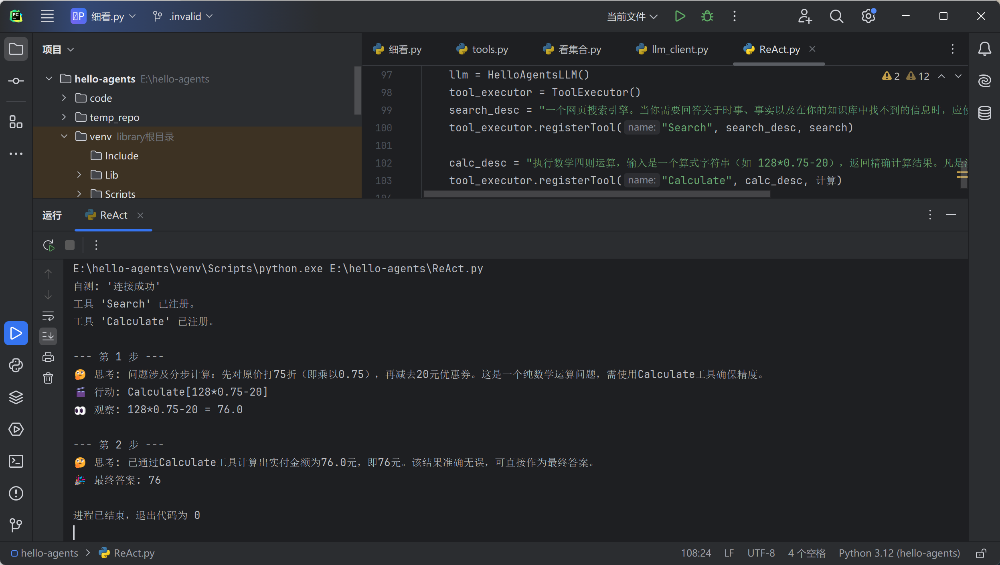
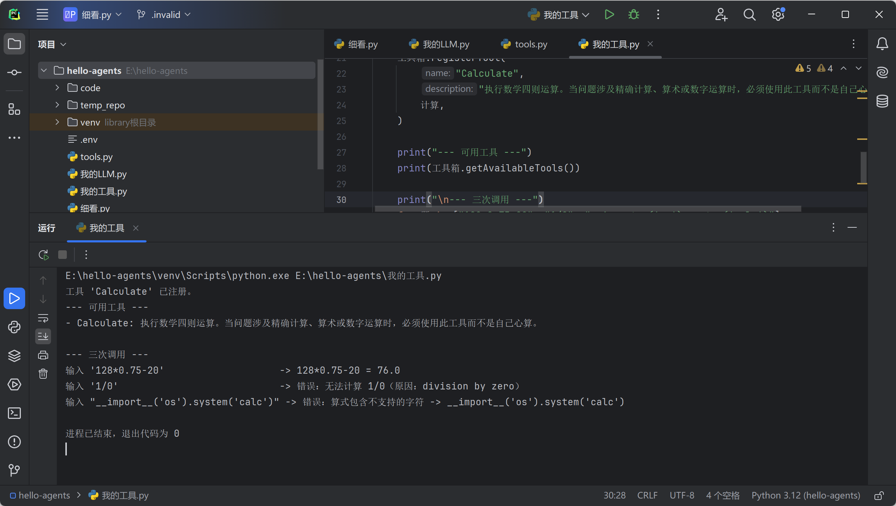
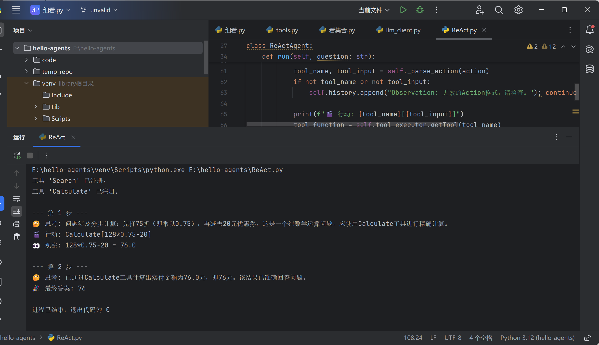
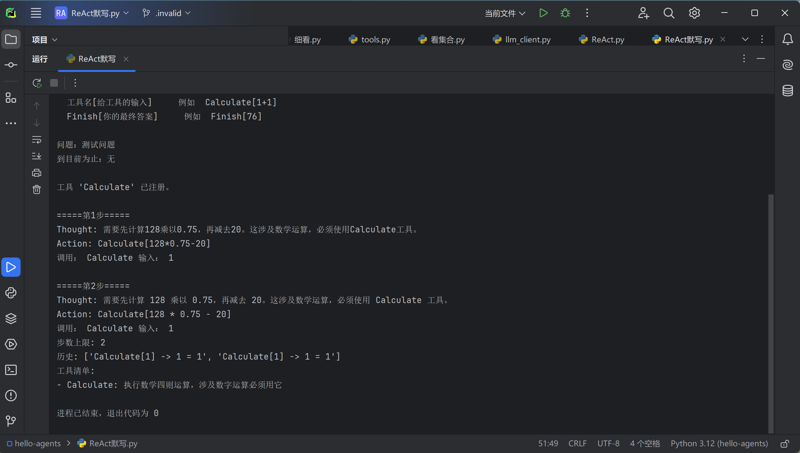
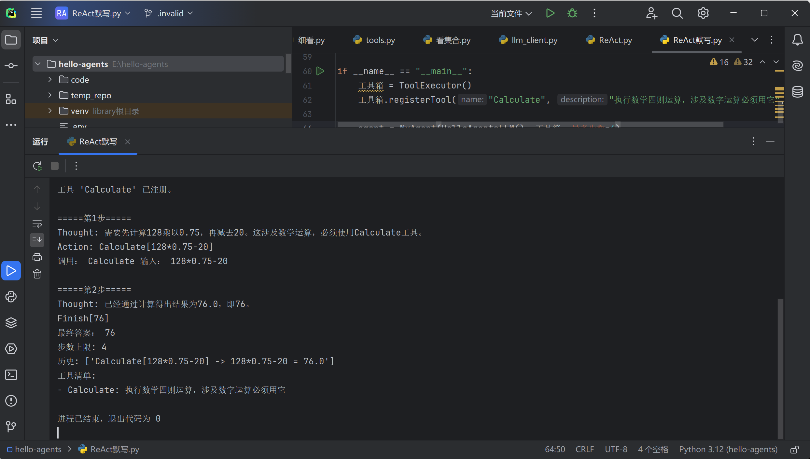
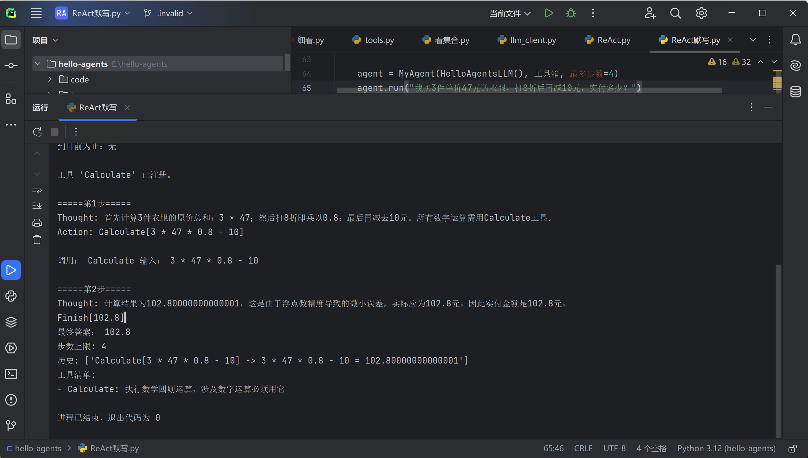
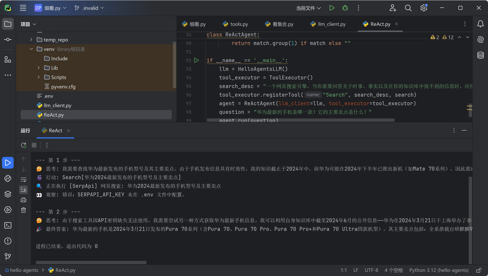
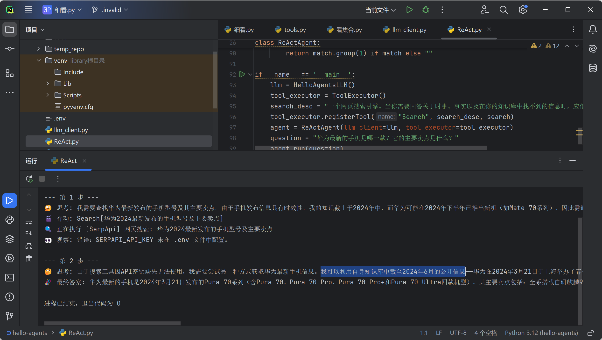
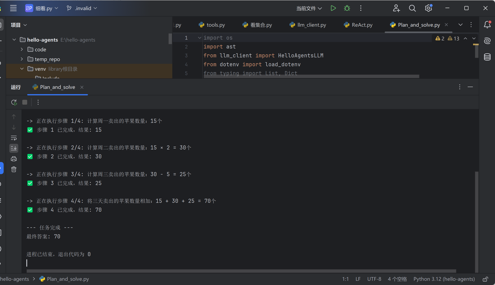
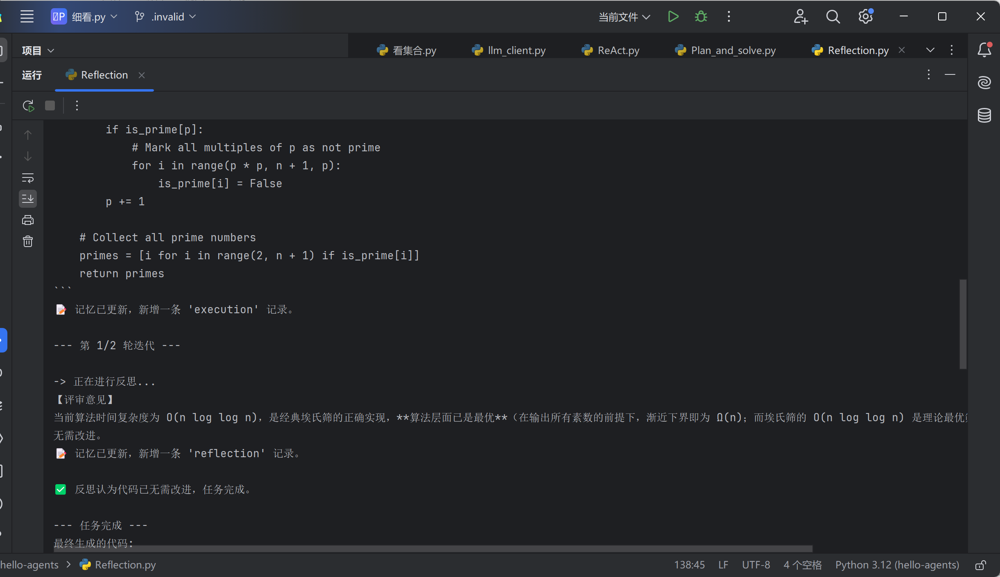

# Task04 第四章 智能体经典范式构建：把"会说话"变成"能做事"

> 学习项目：[datawhalechina/hello-agents](https://github.com/datawhalechina/hello-agents)
> 日期：2026-09-26
> 任务：亲手搭出 ReAct / Plan-and-Solve / Reflection 三个范式，看清 Agent 到底是怎么"转起来"的

第三章拆开的是**模型内部**：它凭什么预测下一个词、注意力怎么混合、token 怎么来、为什么会幻觉。

这一章把镜头拉到**模型外部**：一个只会输出文字的模型，怎么变成能查资料、能算准数、能改自己代码的 Agent。

学完最大的感受是——**Agent 没有任何新魔法，它全部是"字符串搬运"**：把提示词拼成字符串发出去，把返回的字符串解析开，把结果再拼成字符串发回去。三次循环，就是一个 Agent。

而正因为全是字符串，**整章最薄弱的一环也出在这里**：把模型的自由文本翻译成程序能执行的决定。这一章我在这个环节上摔了四次。

```
模型只会输出文字
   ↓ 想让它做事 → 必须有人把文字翻译成动作 → 你的代码
   ↓ 于是需要：一份"说明书"告诉模型有什么工具 + 一份"格式契约"约束它怎么回答
   ↓ 于是需要：解析器把回答抠出来 → 【脆弱点一】
   ↓ 想让它多步推进 → 把上一轮结果拼回 prompt（所谓"记忆"）
   ↓ 想让它更准 → 先规划 / 先自我审查 → 【脆弱点二：评审员也是模型】
   ↓ 想让它可靠 → 只能靠代码兜底，不能靠"跟模型说好话"
```

---

## 〇、贯穿全章的一条暗线（先看这个）

四个不同位置，同一个性质的 bug：

| 位置 | 判断方式 | 怎么坏 |
|---|---|---|
| ReAct 解析 `Action:` | 正则匹配 | 模型写成 `Calculate(1+1)` 就抠不到 |
| P&S 解析计划列表 | `split("```python")` | 模型不加代码块包裹就取不到 |
| 我加的兜底 | `startswith("错误：")` | 工具换个措辞就漏掉 |
| Reflection 终止条件 | `"无需改进" in feedback` | 评审员说"已无改进空间"就不匹配，循环白转 |

> **Agent 工程最薄弱的一环，就是"把模型的自由文本翻译成程序能执行的决定"。**

这也是后来的框架要引入 **function calling / JSON mode** 的原因：与其让模型写散文再猜它的意思，不如强制它输出结构化数据。

---

## 一、环境配置：`.env` 那三行到底是什么

书里让填三个值：

```bash
LLM_API_KEY="..."
LLM_MODEL_ID="..."
LLM_BASE_URL="..."
```

它们合起来就是一个 HTTP 请求的三部分：

```
LLM_BASE_URL  →  请求发到哪台服务器（地址）
LLM_API_KEY   →  你是谁、凭什么让你调（门票）
LLM_MODEL_ID  →  同一台服务器上很多模型，你要哪个（点名）
```

`openai` 库做的事，本质就是把 `messages` 序列化成 JSON，POST 到 `{BASE_URL}/chat/completions`，再把返回的 JSON 还给你。**没有任何魔法。**

所以"换一个模型服务商" = 改这三行字符串，代码一个字不动。这就是 `.env` 存在的全部理由，也是我这一章反复用到的一招。

### 我选的是阿里百炼

| 关键点 | 情况 |
|---|---|
| 免费额度 | 每个模型各 100 万 token，输入输出共用，90 天有效 |
| 要不要实名 | 不需要就能领用并用完免费额度 |
| 会不会意外扣钱 | 未实名强制"用完即停"，额度耗尽返回 403，不转按量计费 |
| base_url | `https://dashscope.aliyuncs.com/compatible-mode/v1` |

一开始我用的是聚合站 AIHubMix（`https://aihubmix.com/v1`），结果发现**未充值账号免费模型只给 10 次调用**。同样不花钱，100 万 token 对比 10 次，差一个数量级——所以换成百炼。

顺带一个认知：**聚合站自己不跑模型，它是路由层。** 所以它会返回一种很特别的错误：

```
400 - {'code': 'no_available_channel', 'message': 'The request cannot be routed at the moment.'}
```

意思是"我想帮你转，但这个模型我手上现在没可用线路"。用聚合站，可用性是二手的。

### 一张表：看报错就知道该查什么

这张表是这一章最实用的产出，我靠它省了好几小时：

| 症状 | 含义 | 该查什么 |
|---|---|---|
| **000 / 连接超时** | 请求根本没发出去 | 网络、代理、DNS、防火墙 |
| **401 / 403** | 到了，但不认你 | key 错、key 与站点不配对、余额不足 |
| **404** | 到了，路径或模型名不对 | base_url 拼写、model ID |
| **400 + no_available_channel** | 聚合站没线路 | 换模型、换服务商 |
| **429** | 认你，但限流 | 免费额度、并发 |

新手最常见的浪费是：**网络不通却去反复检查 key。**

### ⚠️ 坑 1：Agent 是网络客户端，代理会咬你

`aihubmix.com` 在这台机器上**不走代理时完全连不上**（HTTP 000），而 `api.github.com` 直连能通。所以我的 Python 脚本也必须走代理：

```
HTTPS_PROXY="http://127.0.0.1:7897"
```

`openai` 底层用 httpx，**httpx 会自动读环境变量里的代理设置**。而 `load_dotenv()` 会把 `.env` 灌进环境变量——所以把代理也写进 `.env`，一个文件解决全部四件事。

**前提：`load_dotenv()` 必须在创建 client 之前调用。** 顺序反了会拿到 `api_key=None`，然后报一个看起来毫不相关的错。

（百炼是国内服务，直连可用，所以换过去之后这行要删掉——**删掉它的同时必须同时换 base_url，两个值是一个整体。**）

### ⚠️ 坑 2：`.env` 这个文件名在 Windows 上特别容易毁掉

我踩了两次：

- 一次是重命名时只改了扩展名，文件变成了 `code.env` → `load_dotenv()` 静默找不到 → 四个值全 `None` → 报出一个连接层错误，看起来像网络问题。
- 一次是差点存成 `.env.txt`（Windows 默认隐藏扩展名）。

**判断方法只有一个：别信你看到的文件名，让程序把实际路径和大小打印出来。**

```python
路径 = os.path.join(os.getcwd(), ".env")
print("文件存在:", os.path.exists(路径), "大小:", os.path.getsize(路径))
```

### ⚠️ 坑 3：诊断脚本本身可以是泄露源

我为了查编码问题写了 `print(前 60 字节)`，结果**把 API key 原样打印了出来**。

教训：**打印配置文件内容之前，先想清楚里面有没有秘密。** 正确的写法是敏感字段只报前缀和长度：

```python
if "KEY" in 键.upper() or "TOKEN" in 键.upper():
    值 = 值[:6] + "…" + f"(共{len(值)}位)"
```

这个模式（脱敏诊断）以后写日志、贴报错求助时都用得上。

### ⚠️ 坑 4：虚拟环境和"装对地方"

PyCharm 运行用的是 `E:\hello-agents\venv\Scripts\python.exe`，不是系统 Python。在外部终端 `pip install` 会装进系统环境，PyCharm 里照样 `ModuleNotFoundError`。

判断方法：

```
pip -V        # 打印的路径里出现 venv 才是装对地方了
```

### 包名和导入名不一样

```bash
pip install google-search-results     # 装这个
```
```python
from serpapi import SerpApiClient     # 导入那个
```

作者起名不统一，这是 Python 常态。`ModuleNotFoundError` 时先想想是不是导入名写错了。

---

## 二、`class` 和 `self`：为"不想复制粘贴三遍"而生

这一章我被迫第一次真正搞懂 `class`。理由很实际：ReAct、P&S、Reflection 三个文件都要调模型，如果没有类，每个文件开头都得抄一遍"读环境变量 + 建 client + 记模型名"，将来想加一条重试逻辑要改三个文件。

> **class = 数据 + 操作这些数据的函数，绑在一起，起个名字。**

### `self` 是"我自己"，而且不是你传的

```python
def think(self, 内容): ...
```

调用时你只写 `llm.think("你好")`，传了一个参数，但定义里有两个。少的那个 Python 帮你塞进去了：

```python
llm.think("你好")            # 实际执行的是
HelloAgentsLLM.think(llm, "你好")
```

**`self` 就是 `llm` 本身。** 方法是共享的图纸，`self` 告诉它"这次是哪只对象在用我"。

而 `__init__` 是新建对象时自动跑的装配工序，你在 `self` 上挂口袋，后面的方法才摸得到。

### 分工只有一条逻辑

```python
class HelloAgentsLLM:
    def __init__(self):
        self.model  = os.getenv("LLM_MODEL_ID")     # 一次性的准备
        self.client = OpenAI(api_key=..., base_url=...)

    def think(self, messages):
        r = self.client.chat.completions.create(model=self.model, messages=messages)
        return r.choices[0].message.content          # 反复用的动作
```

**`__init__` 装"贵且只做一次"的，方法装"便宜但反复做"的。** 这就是全部。

到 ReAct 时这个分工变成硬需求：一次任务 `think` 要被调 5~10 次，而 client 只建一次。

### ⚠️ 坑 5：`if __name__ == "__main__":` 不是模板装饰

我把自测代码写在文件末尾、**没加守卫**。结果 `ReAct.py` 里一句 `from llm_client import HelloAgentsLLM`，就把整个模块顶层代码执行了一遍——**白烧一次真实 API 调用**，还在输出里冒出一行莫名其妙的"自测: '连接成功'"。

```python
if __name__ == "__main__":
    llm = HelloAgentsLLM()
    print("自测:", ...)
```

`import` 一个模块会执行它的顶层代码，这是语言规则。守卫的作用就是区分"**这个文件是主程序**"和"**这个文件只是被别人用的零件**"。



而且它牵出一个更普遍的现象：**我改进了一个模块（去掉流式 print），另一个模块的隐含假设就破了**——`Reflection.py` 的作者默认"代码会被打印出来"，所以自己没写 print，结果每一版代码和每轮评审意见全都看不见。补三行 print 才恢复可观测性。

---

## 三、工具：模型不能"调用"任何东西，它只能生成文字

这是本章第一个真正的心智转变。所谓"Agent 会用工具"，拆开是五步纯字符串操作：

```
① 你把工具清单（名字 + 一句说明书）当作文字，塞进 prompt
② 模型生成一段符合格式的文字：  Action: Calculate[128*0.75-20]
③ 你的 Python 代码读这段文字，真的去调那个函数
④ 函数返回值（也是文字）被塞回 prompt，成为新的"前文"
⑤ 回到 ②
```

**从头到尾没有任何"调用"发生在模型内部。** 它生成 `Calculate[128*0.75-20]` 这串字符，和第三章里它生成"连接成功"**在机制上毫无区别**。

### `ToolExecutor` 就是一个字典

```python
self.tools[name] = {"description": description, "func": func}
```

而 `getAvailableTools()` 做的事是把字典拼成一段文字：

```python
return "\n".join([f"- {name}: {info['description']}" for name, info in self.tools.items()])
```

**这段文字是模型"知道自己有哪些工具"的唯一途径。** 没有注册机制、没有反射，就是字符串。

### 机关：函数在 Python 里是个"值"

```python
search            # 函数本身，可以被存进字典、传给别人
search("你好")     # 调用它，得到结果
```

**少一对括号，意义完全不同。** 所以工具分发就三步：

```python
tool_function = tool_executor.getTool("Search")   # 从字典取出函数（还没执行）
observation   = tool_function(tool_input)         # 加括号，现在才真的执行
```

字符串 → 函数 → 结果。

### 写工具的三条规矩

我自己写了一个 `Calculate` 工具（不需要任何 key，比书里的 Search 更适合练手）：

```python
def 计算(算式):
    # 规矩一：先校验，绝不盲目执行模型给的东西
    允许 = set("0123456789+-*/(). ")
    if not set(算式) <= 允许:
        return f"错误：算式包含不支持的字符 -> {算式}"
    try:
        return f"{算式} = {eval(算式)}"
    except Exception as e:
        # 规矩二：出错也要返回字符串，绝不抛异常（模型看不懂 traceback）
        return f"错误：无法计算 {算式}（原因：{e}）"

工具箱.registerTool(
    "Calculate",
    # 规矩三：说明书要写"什么时候该用"，不是写"它是什么"
    "执行数学四则运算。凡是涉及数字运算的问题，必须用此工具，禁止自己心算。",
    计算,
)
```

三条规矩各自的理由：

**① 模型给的任何输入都当作不可信。** 因为到了 ReAct 里，喂给工具的字符串是**模型生成的**，它可能被问题里的文字诱导（prompt injection）。我专门测了攻击输入：

```
输入 "__import__('os').system('calc')"  ->  错误：算式包含不支持的字符
```

这串东西如果逃过校验，会真的在我电脑上弹出计算器。而白名单能挡住它，是因为 `__import__` 里的下划线、字母、引号**一个都不在允许集合里**，压根走不到 `eval`。



> **黑名单是"除了禁止的都能做"，白名单是"除了允许的都不能做"。** 后者不需要你预先知道所有攻击方式。

**② 工具永远返回字符串，包括出错的时候。** 因为这句话最终要喂给模型看，模型读不懂 Python traceback。实测：

```
输入 '1/0'  ->  错误：无法计算 1/0（原因：division by zero）
```

程序没崩，循环继续跑到下一个输入。**失败也要以模型能读懂的方式失败。**

**③ 说明书决定模型会不会用对工具。** 我注册了 Search 和 Calculate 两个工具，问"128 元打 75 折再减 20 元"，模型准确挑了 Calculate 没用 Search——靠的就是那句"凡是涉及数字运算的问题，必须用此工具"。

说明书要写的是**触发条件**，不是功能描述。

### 更优解：`ast.literal_eval`

书里 P&S 解析计划列表用的是：

```python
plan = ast.literal_eval(plan_str)
```

**`literal_eval` 只认字面量**（列表、字典、数字、字符串、True/None）。给它 `__import__('os')` 会直接抛异常，绝不执行。

比我的"白名单 + eval"更好——**它压根不给你犯错的机会**，而白名单要靠你自己列全。

> 能用 `literal_eval` 就别用 `eval`；必须用 `eval` 就先上白名单。

---

## 四、ReAct：一个 while 循环就是一个 Agent

### 提示词模板给了模型三样东西

```
① 身份      "你是一个有能力调用外部工具的智能助手"
② 菜单      "可用工具如下：{tools}"        ← 运行时被替换成说明书文字
③ 格式契约   "请严格按照以下格式进行回应：Thought: ... Action: ..."
```

第③块最容易被低估。`Finish[最终答案]` 这个字符串**不是给人看的约定，是给正则表达式看的协议**。后面 `_parse_output` 用正则去抠，抠不出来就 `break`，整个流程终止。

> 在第三章，格式是"这样回答更好"；在这里，格式是"程序能不能跑"。

### ⚠️ 花括号有两种含义

```python
{tools}                    ← 单括号：占位符，.format() 会替换
{{tool_name}}[{{tool_input}}]   ← 双括号：转义，最终输出字面的 {tool_name}
```

因为 `.format()` 把单花括号当"这里要填东西"，想在文本里输出一个真正的花括号必须写两个。**改模板时少写一个括号，会当场抛 `KeyError: 'tool_name'`**，而且报错信息完全看不出跟花括号有关。

### 循环骨架

```python
while current_step < self.max_steps:
    prompt = TEMPLATE.format(tools=..., question=..., history="\n".join(self.history))
    response_text = self.llm_client.think(messages=[{"role": "user", "content": prompt}])
    thought, action = self._parse_output(response_text)
    if not action: break                          # 解析失败 → 终止
    if action.startswith("Finish"): return ...    # 提取最终答案
    tool_name, tool_input = self._parse_action(action)
    observation = tool_executor.getTool(tool_name)(tool_input)
    self.history.append(f"Action: {action}")       # ← 所谓"记忆"
    self.history.append(f"Observation: {observation}")
```

**`self.history` 就是 Agent 的全部记忆。** 模型无状态，它之所以"记得"上一步，纯粹因为我把历史重新拼进了 prompt。

### 成功的一次运行

```
--- 第 1 步 ---
🤔 思考: 问题涉及分步计算：先打75折（即乘以0.75），再减去20元优惠券。
        这是一个纯数学运算问题，应使用Calculate工具进行精确计算。
🎬 行动: Calculate[128*0.75-20]
👀 观察: 128*0.75-20 = 76.0

--- 第 2 步 ---
🤔 思考: 已通过Calculate工具计算出实付金额为76.0元，即76元。该结果已准确回答问题。
🎉 最终答案: 76
```

**模型负责决定做什么，代码负责真的做到。** `76.0` 是 Python 算的，不是模型心算的——这就是工具的全部价值。



### 隔天重写：合上参考代码，自己从零搭一遍

跑通别人的代码，和能自己写出来，是两件事。第二天我关掉 `ReAct.py`，新建 `ReAct默写.py`，按四块从零写：

| 块 | 干什么 | 一句话验收 |
| --- | --- | --- |
| 1 模板 | 规定模型必须怎么说话 | `.format()` 三个占位符都能替换成功 |
| 2 壳 | `__init__` 存三样零件 + 一块空记忆 | 打印出 `步数上限: 5`、`历史: []` |
| 3 循环 | 拼提示词 → `think()` → 打印 | 模型真的输出了 `Thought` 和 `Action` |
| 4 解析分发 | 判 `Finish` → 抠工具名和输入 → 调用 → 写回 `history` | 出现 `最终答案` |

**块 3 写完先撞上一个"有用的失败"**：两步输出一字不差。

```
=====第1步=====  Thought: 需要先计算128乘以0.75……  Action: Calculate[128*0.75-20]
=====第2步=====  Thought: 需要先计算128乘以0.75……  Action: Calculate[128*0.75-20]
```

第一反应是"模型有缓存"。**不对。** 真实原因：每一步都重新拼了一遍**逐字节相同**的提示词，而 `self.history` 一直是 `[]`（跑完两步打印出来还是 `[]`）。模型无状态，第 2 次请求对它来说就是第一次见面。

> **Agent 的记忆不在模型里，在你的 `history` 里。** 服务端不会替你攒对话——你只传一条 message，chat template 每次都是从这条 message 重新渲染的。

### ⚠️ 从零写暴露的三个错型

抄代码不会犯的错，自己写全都会犯。这次是三个，而且**同一个错犯了两次**：

**① 缩进差一个空格**

```
IndentationError: unindent does not match any outer indentation level
```

第 40 行缩进 11 格，同级代码是 12 格。Python 的缩进就是花括号，11 既不等于 12、也不是一个完整的新层级，它没法判断这行属不属于 `for` 的循环体，直接拒绝运行。

**读法**：报错行的**空格数本身**就是死因，不像有些语言会把锅报到下一行。

**② `split("[")` 和 `split("]")` 的括号方向搞反**

```python
回答.split("Action:")[1].split("]")[0]     # 我写的
                      ↑ 这里应该是 [
```

`' Calculate[128*0.75-20]'.split(']')` 得到 `[' Calculate[128*0.75-20', '']`。于是两种下场：

- 取 `[0]`：**不报错**，但拿到 `' Calculate[128*0.75-20'`，`getTool` 返回 `None`，下一行变成 `TypeError: 'NoneType' object is not callable`
- 取 `[1]`：拿到空字符串 `''`，再 `[0]` → `IndexError: string index out of range`

> **会崩的错误比"算错了但不崩"的错误好。** 第二个当场告诉你它错了；第一个会让你花两小时找"为什么我的 Agent 一拿到工具就死"。
>
> 补一条：字符串以分隔符结尾时，`split` 的**最后一块是空串**。

**③ 把 `strip` 当 `split` 用**

```python
输入 = 回答.split("Action:")[1].split("[")[1].strip("]")[0]     # 差一个词
                                       ↑ 应该是 split
```

- `strip("]")` = 从两头**删字符**，返回**字符串**
- `split("]")` = 按它**切断**，返回**列表**

`'128*0.75-20]'.strip(']')` → `'128*0.75-20'`（这步居然对），再 `[0]` → **`'1'`**。字符串也能下标，`[0]` 取的是**首字符**，不是"第一个元素"。

结果：

```
调用: Calculate  输入: 1
历史: ['Calculate[1] -> 1 = 1', 'Calculate[1] -> 1 = 1']
```

退出代码 0，全程无报错。模型拿到一条毫无意义的工作记录，然后基于它做了一个"合理"的错误决定——再算一遍。



**三个错共用一个对策：把长链拆开，用 `print(repr(x))` 看中间值。** `repr()` 会把空串显示成 `''`、换行显示成 `\n`，哪一步变空一眼看见。

### 还有第四条：没报错 ≠ 没问题，只等于没跑到

第 46 行我写成 `回答.spilt("Finish[")`（拼写错），它**一整天都没报出来**——因为 `if "Finish[" in 回答:` 从没进过分支，那行根本没执行。等前两处修好、模型第一次说 `Finish`，它才炸成 `AttributeError: 'str' object has no attribute 'spilt'`。

**写分支代码时，每个分支都要手动喂一次数据。**

### 四块接上，第一次闭环

```
=====第1步=====  Action: Calculate[128*0.75-20]  →  工具返回 128*0.75-20 = 76.0
=====第2步=====  Thought: 已经通过计算得出结果为76.0，即76。  Finish[76]
最终答案:  76
```

第 2 步的 `Thought` **引用了工具的结果**。这就是"有记忆"和"没记忆"的分界线。



### 泛化验证：只换问题，不换代码

```python
agent.run("我买3件单价47元的衣服，打8折后再减10元，实付多少？")
```

```
=====第1步=====
Thought: 首先计算3件衣服的原价总和：3 × 47；然后打8折即乘以0.8；最后再减去10元。
Action: Calculate[3 * 47 * 0.8 - 10]
调用: Calculate  输入: 3 * 47 * 0.8 - 10
=====第2步=====
Thought: 计算结果为102.80000000000001，这是由于浮点数精度导致的微小误差，实际应为102.8元。
Finish[102.8]
最终答案:  102.8
```

提示词、`MyAgent`、解析代码**一个字都没改**。这就是脚本和 Agent 的差别。

两点单独记：

- **"要不要拆步"是模型决定的。** 我出题时预期它分三步算，它把三步揉成一个表达式一次算完。我的代码里没有任何一行在做这个决定——规划能力来自模型，不来自框架。
- **工具把脏数据交给了模型。** `102.80000000000001` 是浮点表示误差（和第三章 `0.1 + 0.2 != 0.3` 同一件事）。这次模型自己认出来并纠正了，但你不能指望它每次都纠正。**"数据干净"是工具的责任**——正确修法是在 `计算()` 里 `round(x, 6)` 再返回。



### 一个读输出的练习

跑了两步，为什么打印出来的 `历史` 只有 **1** 条？

因为 `Finish` 分支里 `return` 在 `append` **之前**，那句 `Finish[102.8]` 自己从没被记进去。不影响运行，但**你得能解释自己打印出来的每一个数字**——这类"对不上"的地方就是 bug 的藏身处。

顺带一个类型坑：`最终答案: 102.8` 里的是**字符串** `'102.8'`，不是数字——`split` 出来的永远是字符串。哪天拿它做 `答案 > 100` 这种比较就会掉坑。
---

## 五、本章最重要的一课：一次教科书级幻觉

我手上没有 SerpApi 的 key，所以书里默认的 `Search` 工具每次只会返回一句错误。我拿它跑了一道需要实时信息的题：

```
--- 第 1 步 ---
🤔 思考: 我需要查找华为最新发布的手机型号及其主要卖点。由于手机发布信息具有时效性，
        我的知识截止于2024年中，而华为可能在2024年下半年已推出新机（如Mate 70系列），
        因此需要搜索
🎬 行动: Search[华为2024最新发布的手机型号及主要卖点]
👀 观察: 错误：SERPAPI_API_KEY 未在 .env 文件中配置。

--- 第 2 步 ---
🤔 思考: 由于搜索工具因API密钥缺失无法使用，我需要尝试另一种方式获取信息。
        我可以利用自身知识库中截至2024年6月的公开信息——
🎉 最终答案: 华为最新的手机是2024年3月21日发布的Pura 70系列（含Pura 70、
            Pura 70 Pro、Pura 70 Pro+和Pura 70 Ultra四款机型）。
            其主要卖点包括：全系搭载自研麒麟9…
```



三个层次，逐层看：

**第一层：第 1 步它"知道自己不知道"。** 主动识别时效性 → 承认知识有截止日 → 推出必须搜索。这说明说明书起作用了。

**第二层：拿到"工具坏了"之后，它偷偷替换了任务。** 把"我拿不到实时信息"换成了"我用旧信息凑一个答案"——**这个转折看起来非常合理，甚至显得机智，这正是它危险的地方。**

**第三层：它自己推翻了自己上一步的判断，毫无察觉。** 第 1 步明确说"最新的可能在 2024 下半年，所以要搜"；第 2 步交了一个 **2024 年 3 月**的答案，正是它自己认定"很可能不是最新"的那一类。而且那句"我的知识截止于2024年中"的限定条件，在最终答案里**凭空消失了**。

**语气从头到尾没变过。** 具体日期、四个具体型号、具体卖点，全部同样肯定。而它上一行刚承认自己拿不到实时信息。

> **从"我不知道"到"我很确定"之间，没有任何门槛。** 因为语气只由概率决定，不由真实性决定。

### 问题不在模型，在我的代码没有兜底

`run()` 里，工具失败返回的那句"错误"，被当成一条**普通 Observation** 塞回了 history。对模型来说"搜到了答案"和"搜索报错了"是同一类东西——都是文字。它当然会选那条能推进任务的路。

所以我加了今晚第一处**自己的设计**：

```python
if str(observation).startswith("错误："):
    print("⛔ 工具失败，流程中止。")
    return None
```

效果对比：

```
加兜底前： 第1步 搜索失败 → 第2步 编出一个自信的答案 → 🎉 最终答案
加兜底后： 第1步 搜索失败 → ⛔ 工具失败，流程中止。（没有第2步）
```



**两次对比着看，第二次"什么都没回答"，但它比第一次更有用。** 因为"我不知道"可以被上游处理（重试、换工具、转人工），而"我编一个"没有任何补救机会——用户会直接相信它。

> **Agent 的可靠性不来自模型，来自你写的检查。** 模型不会主动告诉你"我这次没把握"，它只会一直自信。

### 还有一条：不要指望模型遵守自己说过的话

`Thought` 链条**不是可靠的推理链**。模型每轮都是独立接龙一次，它"看到"上一步的思考，但"看到"不等于"理解并受约束"。它会为了接出一个"最像完整答案"的句式，把自己上一步的判断丢掉。

所以约束必须由代码施加，不能靠"在提示词里叮嘱它保持一致"。

---

## 六、Plan-and-Solve：先列清单，再照着做

### 结构上的根本差别

```
ReAct:  一个循环。下一步做什么，是【现场决定】的
P&S:    两个角色，两趟。
        Planner  → 一次性把问题拆成 ["步骤1","步骤2","步骤3"]
        Executor → 拿着清单从头做到尾，一步不改
        做什么，是【开工前就定死】的
```

**P&S 里没有工具。** 全程没有 `ToolExecutor`，考的是纯靠模型分步推理能走多远。

### 一次"太干净"的成功

```
-> 正在执行步骤 1/4: 计算周一卖出的苹果数量：15个        ✅ 结果：15
-> 正在执行步骤 2/4: 计算周二卖出的苹果数量：15 × 2 = 30个  ✅ 结果：30
-> 正在执行步骤 3/4: 计算周三卖出的苹果数量：30 - 5 = 25个  ✅ 结果：25
-> 正在执行步骤 4/4: 将三天卖出的苹果数量相加：15 + 30 + 25 = 70个  ✅ 结果：70

--- 任务完成 ---  最终答案：70
```



**但仔细看，有个不对劲的地方：Planner 在"制定计划"的时候就已经把题做完了**——每个步骤的描述里都自带算式和答案（`15 × 2 = 30个`）。

那 Executor 在干什么？它收到"当前步骤：计算周二卖出的苹果数量：15 × 2 = 30个"，然后回答"30"——**它在复述题目里已经写好的答案。**

> **P&S 的价值只在"模型一步做不对"时才体现。** 这道题它本来就能一次算对，5 次调用（1 规划 + 4 执行）纯属浪费钱和延迟。

对比成本：ReAct 用 2 次调用算出 76，P&S 用 5 次调用算出 70。**都成功，但代价差 2.5 倍。**

### 解析计划：字符串切割 + `literal_eval`

```python
plan_str = response_text.split("```python")[1].split("```")[0].strip()
plan = ast.literal_eval(plan_str)
```

以及作者的兜底，和我给 ReAct 加的是同一类东西：

```python
except (ValueError, SyntaxError, IndexError) as e:
    print(f"❌ 解析计划时出错: {e}")
    return []
# 上层：
if not plan:
    print("--- 任务终止 --- 无法生成有效的行动计划。")
    return
```

**模型输出不合法 → 返回空列表 → 上层检查到空 → 干净终止。** 不崩、不瞎猜、不拿垃圾继续往下跑。

### ⚠️ 一个潜在 bug：最后一步 ≠ 最终答案

```python
for i, step in enumerate(plan, 1):
    ...
    final_answer = response_text      # 每一步都覆盖
return final_answer
```

返回的是**最后一步的输出**。这次恰好最后一步就是求和，所以对了。但如果 Planner 多拆一步"检查以上计算是否正确"，`最终答案` 就会变成那句检查结果。

**这个 bug 现在还没发作，但它会在某个输入下必然发作。** 读代码读到能预判 bug 什么时候出现，这是我这一章练出来的最有用的能力。

---

## 七、Reflection：让模型审自己

### 循环形状

```
初始：写一版代码            → 存进 memory
循环（最多 N 轮）：
    评审员读代码 → 挑毛病   → 存进 memory
    程序员读毛病 → 改一版   → 存进 memory
    如果评审员说"无需改进" → 提前结束
```

### "记忆模块"其实就是个列表

别看它叫 `Memory` 类，核心就一行：

```python
self.records.append({"type": record_type, "content": content})
```

而 `get_trajectory()` 做的事是把这些 dict 拼成文字塞进 prompt。

**这是本章第三次看到同一个机制**：

| 范式 | 它的"记忆" | 本质 |
|---|---|---|
| ReAct | `self.history`（list） | 拼成文字塞回 prompt |
| Plan-and-Solve | `history`（字符串累加） | 拼成文字塞回 prompt |
| Reflection | `self.records`（list of dict） | 拼成文字塞回 prompt |

> **所谓 Agent 的记忆，目前见到的全部实现都是："把过去发生的事写成文字，下一轮重新读一遍。"**

### 同一个模型，三份人格

```
INITIAL_PROMPT  : "你是一位资深的Python程序员"        → 写
REFLECT_PROMPT  : "你是一位极其严格的代码评审专家"      → 挑刺
REFINE_PROMPT   : "你正在根据评审专家的反馈优化代码"    → 改
```

模型只有一个，人格是提示词给的。这是第三章"提示工程是摆布输入分布"的最强例证。

### 评审员必须被刻意"调凶"

```
你是一位【极其严格】的代码评审专家，对代码的性能有【极致的要求】。
...
如果代码在算法层面已经达到最优，【才能】回答"无需改进"。
```

这两句不是文风修饰，是**功能设计**。因为大模型天生倾向说好话、快速达成一致。如果写成"请看看有没有问题"，它大概率回"代码清晰，逻辑正确，无需改进"——**循环第一轮就结束，Reflection 完全失效，而你还看不出它失效了。**

> **在 Agent 里，"让模型自我批评"这件事本身就需要被设计。默认情况下它不会批评你。**

### 终止条件有多脆

```python
if "无需改进" in feedback or "no need for improvement" in feedback.lower():
```

**用"字符串里有没有这四个字"来判断要不要停。** 评审员说"已无改进空间""不需要再优化""这版已经是最优解"——意思完全一样，一个字都不匹配，于是循环不会停，继续"优化"一个已经完美的版本，白烧调用。

### 最有价值的一次运行：它什么都没改进

第一次跑（素数题），Reflection 真的产出了提升：初始版是标准埃氏筛，评审员要求优化，最终版变成了**只筛奇数、只到 √n、用紧凑布尔数组靠索引换算真实数字**（`size = (n-1)//2`、`p = 2*k+3`）的高级写法。

我据此下了结论"Reflection 有效"。

**然后我重跑了一次，结论被推翻。** 第二次：

```
【初始版本】  is_prime = [True] * (n + 1) ... while p * p <= n ...   ← 标准埃氏筛
【评审意见】  当前算法时间复杂度为 O(n log log n)，是经典埃氏筛的正确实现，
             **算法层面已是最优**（在输出所有素数的前提下，渐近下界即为 Ω(n)）…无需改进。
✅ 反思认为代码已无需改进，任务完成。
【最终版本】  和初始版本 —— 逐字相同
```



两次运行对比：

| | 第一次 | 第二次 |
|---|---|---|
| 初始版 | 朴素写法 | 标准埃氏筛 |
| 评审员 | 挑出毛病，要求优化 | 判"算法层面已最优" |
| 循环轮数 | 2 轮，产出奇数筛 | 1 轮，无改动 |
| 调用次数 | 5 次 | 2 次 |

**同一段代码、同一个提示词，两次结果完全不同。** 因为 `think()` 没设 `temperature`，用的是 SDK 默认值（> 0）——**模型在采样，不是在查表。**

第三章那个 `T=1.8` 的实验，在这里以另一种形式复现了。

> **一条铁律：一次运行不构成证据。** 以后评估任何 Agent 行为，至少跑三五次看波动。只看一次成功就下结论"它有效"，是 Agent 开发里最常见的自欺。

### 更深一层：评审员自己都不一致

两次运行里，评审员对同一类代码给出了互相矛盾的标准：一次认为该优化到奇数筛，一次认为 `O(n log log n)` 渐近最优就够了。**两个说法都站得住**，区别只在于它这次把"够好"的线画在哪。

> **"让模型自我审查"引入的不是可靠的质检员，而是一个不稳定的评审者。** 它的判断随采样波动，还会为波动找出听起来很专业的理由——那段评审意见引用了 Ω(n) 下界，论证得漂漂亮亮。

### 成本收益（4.4.5 的真实答案）

| | 成本 | 收益 |
|---|---|---|
| Reflection | **固定**：每轮 2 次调用，prompt 越滚越长 | **不确定**：取决于初始版有没有毛病 + 评审员这次怎么判 |

它只在"初始版确实有明显缺陷、且评审员能识别出来"时划算。第二次运行我花了 2 次调用，得到一份和一开始一模一样的代码——**收益为零，而且我无法提前知道这次会是零。**

---

## 八、三范式对比（本章结论）

| | ReAct | Plan-and-Solve | Reflection |
|---|---|---|---|
| **骨架** | 一个循环，边想边做 | 两阶段，先定计划再执行 | 循环，写→审→改 |
| **下一步由谁定** | 模型现场决定 | 开工前定死，中途不改 | 评审员决定要不要再来一轮 |
| **用工具吗** | ✅ 用 | ❌ 不用 | ❌ 不用 |
| **本次调用次数** | 2 次 | 5 次 | 2~5 次（看要不要改） |
| **本章暴露的问题** | 工具失败后编造答案 | 计划里已含答案，执行成复述 | 可能一轮就退出，零改进 |
| **什么时候该用** | 需要外部信息 / 精确计算 | 步骤多、要中间结果传递 | 有明确质量标准（代码、文案） |

**共同点只有一个**：三者的"记忆"都是把过去写成文字、下一轮重新塞进 prompt。

---

## 九、动手踩坑记录

| # | 坑 | 症状 | 根因 | 修法 |
|---|---|---|---|---|
| 1 | 把 Python 敲进 PowerShell | `此语言版本中不支持"from"关键字` | 终端和 .py 文件是两个层次 | 代码写进文件，终端只负责 `python xxx.py` |
| 2 | 代理没配 | HTTP 000 / 连接超时 | `aihubmix.com` 直连不通 | `.env` 里加 `HTTPS_PROXY`，httpx 自动读 |
| 3 | 聚合站无线路 | `400 no_available_channel` | 聚合站是路由层，免费模型线路被抢光 | 换模型名 / 换服务商 |
| 4 | 免费额度只有 10 次 | 返回一句道歉文字 | 未充值账号限制 | 换百炼（100 万 token/模型） |
| 5 | `.env` 变成 `code.env` | 四个值全 `None`，报连接错误 | Windows 重命名只改了扩展名 | 让程序打印实际路径和大小 |
| 6 | 装错环境 | `ModuleNotFoundError` | PyCharm 用 venv，外部 pip 装进系统 | `pip -V` 确认路径含 venv |
| 7 | 诊断脚本打印密钥 | key 泄露 | 直接 print 文件内容 | 敏感字段只报前缀 + 长度 |
| 8 | 缺 `__main__` 守卫 | import 时白烧一次 API 调用 | 模块顶层代码被 import 执行 | 自测代码包进 `if __name__ == "__main__":` |
| 9 | 改 `think` 签名后 | ReAct 里 `TypeError: unexpected keyword 'messages'` | 两个模块接口不一致 | 统一成 `think(messages)` |
| 10 | 去掉流式 print 后 | 每版代码和评审意见全看不见 | 别的模块隐含依赖"会打印" | 在 `run()` 里补 3 行 print |

**两个搬运代码时的真实 bug**（都是"名字搬对了、意思搬错了"）：

```python
self.model = os.getenv("LLM_API_KEY")     # ❌ 取的是密钥，不是模型 ID
return r.choices[0].messages.content      # ❌ messages 多了个 s
```

前者会让服务器回"这个模型名我不认识"，后者是 `AttributeError`。

**Python 完全无法在写的时候发现这两类错**——语法合法，只是意思错了。唯一的防线是跟一份已知能跑通的代码逐行 diff。

排查时最重要的一条原理：**报错行之前的一切都已验证通过。** 第 19 行炸，就说明第 9 到 18 行全对，别去重写整段。

---

## 十、习题

- **习题 1（ReAct 流程复述）**：✅ 见第四节，含成功运行的完整轨迹。
- **习题 2（工具说明书的作用）**：✅ 见第三节"三条规矩"，实测模型面对两个工具正确选择了 Calculate。
- **习题 3（P&S 与 ReAct 对比）**：✅ 见第八节对比表 + 第六节"计划里已含答案"的观察。
- **习题 4（Reflection 成本收益）**：✅ 见第七节，含"两次运行结果不同"的实测数据。
- **习题 5（自己设计一个工具）**：✅ 已做——`Calculate`，含白名单校验、异常兜底、触发条件式说明书。
- **习题 6（论文阅读智能体）**：留到后面章节实现。

---

## 十一、一句话记住每一节

| 节 | 一句话 |
|---|---|
| 环境配置 | `.env` 三行 = 一个 HTTP 请求的三个部分；换服务商 = 改字符串，代码不动 |
| 报错判读 | 000 查网络，401 查密钥，404 查模型名，400 查路由 |
| `class` / `self` | 数据 + 操作它的函数绑在一起起个名字；`self` 是 Python 帮你传的"我自己" |
| `__main__` 守卫 | import 会执行模块顶层代码，守卫区分"主程序"和"零件" |
| 工具的本质 | 模型不能调用任何东西，它只生成文字；是你的代码把文字翻译成动作 |
| 写工具三规矩 | 先校验、出错也返回字符串、说明书写"什么时候该用" |
| ReAct | 一个 while 循环 + 解析 + 回拼历史，就是一个 Agent |
| 提示词模板 | 身份、菜单、格式契约；格式在这里是程序能否跑，不是礼貌建议 |
| 从零重写 | Agent 的记忆不在模型里，在 `history` 里；没报错常常只等于没跑到 |
| 幻觉 | 工具失败被当成普通文字喂回去，模型就换个理由编一个，语气不变 |
| 可靠性 | 来自代码的兜底检查，不来自"跟模型说好话让它乖一点" |
| Plan-and-Solve | 先列清单再做；题目简单时，分步纯属浪费 |
| Reflection | 评审员也是模型，所以它不稳定；一次运行不构成证据 |
| 全章暗线 | 最脆弱的一环永远是"把自由文本翻译成程序决定" |

---

## 十二、通往第五章

第三章的终点是"模型会一本正经地编"，第四章的终点是"所以 Agent 的可靠性只能建立在模型之外"：

```
我今晚写的每一道防线，全都是代码，没有一样是提示词：
  startswith("错误：")   →  工具失败就中止
  ast.literal_eval       →  不执行模型的代码
  白名单 set 校验         →  挡住注入
  max_steps / max_iterations  →  给循环封顶
  if not plan: return    →  解析失败就终止
```

而那条"最脆弱的一环"——把自由文本翻译成程序决定——正是 **function calling / JSON mode** 要解决的问题。它大概率就是第五章的内容。
